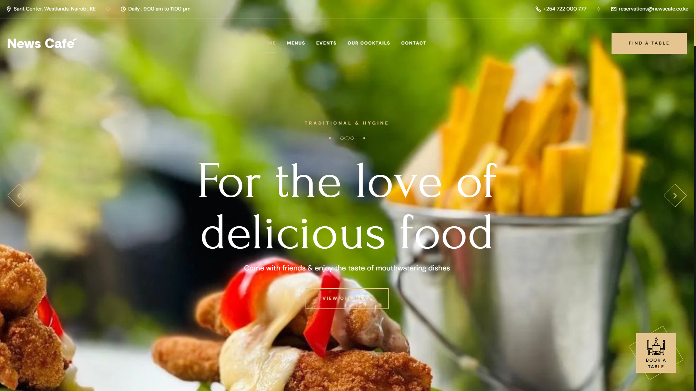

<div align="center">
  
  <!-- 
  
  
[](https://twitter.com/intent/follow?screen_name=codewithsadee_) -->
  <!-- [](https://youtu.be/CjVGp5kGHxA) -->

  <br />
  <br />

  <h2 align="center">News Cafe Website</h2>

  A Fully Responsive Website for News Cafe, <br />across all devices, build using HTML, CSS, and vanilla JavaScript.

  <a href="https://cafe-the-news.vercel.app/"><strong>➥ Live Demo</strong></a>

</div>

<br />

### Live Site Screeshots



### Prerequisites

Before you begin, ensure you have met the following requirements:

* [Git](https://git-scm.com/downloads "Download Git") must be installed on your operating system.

### Run Locally

To run **News Cafe** locally, run this command on your git bash:

Linux and macOS:

```bash
sudo git clone https://github.com/Xanderyeng/news-cafe.git
```

Windows:

```bash
git clone https://github.com/Xanderyeng/news-cafe.git
```

### Contact

If you want to contact with me you can reach me at [SpaceAI](https://chepkiyeng.netlfiy.app).

### License

[MIT](https://choosealicense.com/licenses/mit/)
